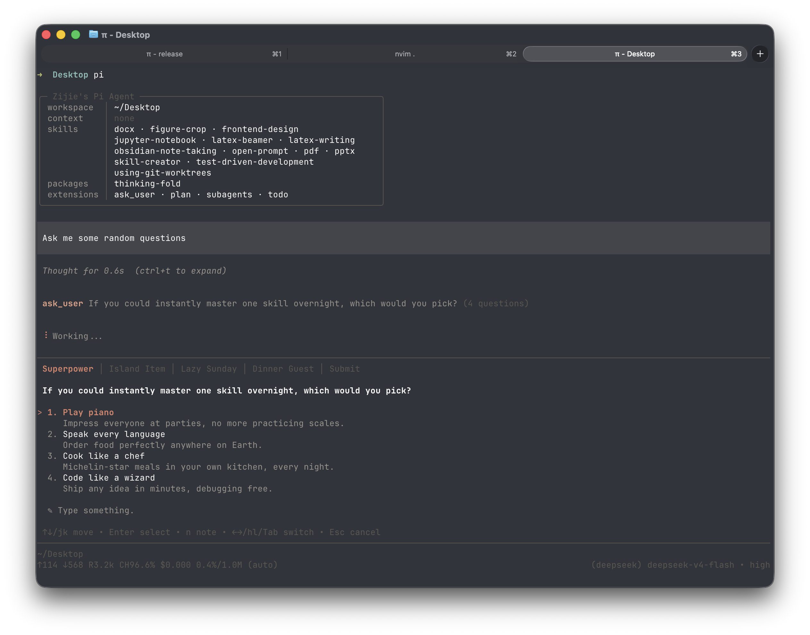

# ask-user

`ask_user` lets the agent ask you questions instead of guessing.

## What the user sees



## What the model sees

**Tool definition** (request payload):

```json
{
  "name": "ask_user",
  "description": "Ask one or more user questions. Supports options with descriptions, multi-select, and free text. Returns compact answers.",
  "parameters": {
    "type": "object",
    "required": ["questions"],
    "properties": {
      "questions": {
        "type": "array",
        "minItems": 1,
        "maxItems": 4,
        "description": "Question(s) to ask.",
        "items": {
          "type": "object",
          "required": ["question", "header"],
          "properties": {
            "question": {
              "type": "string",
              "maxLength": 1000,
              "description": "The complete question. Clear, specific, ends with a question mark."
            },
            "header": {
              "type": "string",
              "maxLength": 16,
              "description": "Short chip labeling this question in the dialog, e.g. \"Approach\", \"Library\". MAX 16 CHARACTERS."
            },
            "options": {
              "type": "array",
              "minItems": 2,
              "maxItems": 4,
              "description": "2-4 distinct options that are mutually exclusive unless multiSelect, with the recommended option first. A free-text row is added automatically—do not author one. Omit for a free-text question.",
              "items": {
                "type": "object",
                "required": ["label", "description"],
                "properties": {
                  "label": {
                    "type": "string",
                    "maxLength": 60,
                    "description": "Short option label (1-5 words). MAX 60 CHARACTERS."
                  },
                  "description": {
                    "type": "string",
                    "maxLength": 300,
                    "description": "What this option means or implies: trade-offs, consequences, etc."
                  }
                }
              }
            },
            "multiSelect": {
              "type": "boolean",
              "default": false,
              "description": "Allow selecting multiple options. Use when options are not mutually exclusive. Defaults false."
            }
          }
        }
      }
    }
  }
}
```

**System prompt guidance** — this extension's contribution, alongside the other tools in the session:

```
Available tools:
- ask_user: Ask up to 4 concise blocking questions

Guidelines:
- Surface uncertainty or ambiguity. Whenever missing user input blocks progress, use ask_user to ask rather than guess.
```

## Install

```bash
pi install npm:@zjie-wang/pi-ask-user
```
