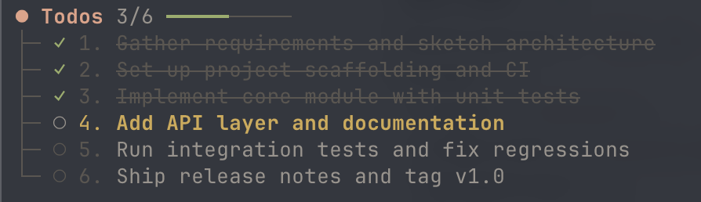

# todo

A todo tracker lives in the session.

It is reconstructed from past tool results, so it survives restarts and stays visible across the session tree. In the TUI a live widget shows the phases, the active one, and a progress bar.

## What the user sees



## What the model sees

**Tool definition** (request payload):

```json
{
  "name": "todo",
  "description": "Track complex work in phases.",
  "parameters": {
    "type": "object",
    "required": ["action"],
    "properties": {
      "action": {
        "type": "string",
        "enum": ["new", "update", "list", "clear"],
        "description": "Action: new creates or replaces the tracker and activates its first phase; update records the progress; list returns the tracker; clear removes it."
      },
      "items": {
        "type": "array",
        "items": {
          "type": "string",
          "minLength": 1,
          "description": "Phase title."
        },
        "minItems": 1,
        "description": "Ordered phase titles. Required for new."
      },
      "completedIds": {
        "type": "array",
        "items": { "type": "integer", "minimum": 1 },
        "minItems": 1,
        "uniqueItems": true,
        "description": "IDs completed; required for update. If the active phase is completed, the next pending phase becomes active automatically."
      },
      "activeId": {
        "type": "integer",
        "minimum": 1,
        "description": "ID of an unfinished phase to jump to manually."
      }
    },
    "additionalProperties": false
  }
}
```

**System prompt guidance** — this extension's contribution, alongside the other tools in the session:

```
Available tools:
- todo: Track multi-phase progress

Guidelines:
- Use todo for complex, multi-step work with at least three meaningfully coordinated phases. Skip it for simple tasks or when coordination adds no value.
- Once a todo tracker is started, remember to update it promptly after each phase completes.
```

## Actions

- `new` — start a tracker from ordered phase titles; the first phase becomes active.
- `update` — mark phases complete (`completedIds`), optionally jump to a phase (`activeId`); the next pending phase activates automatically.
- `list` — read the current tracker.
- `clear` — reset it.

There is also a `/todos` command to show or clear the tracker from the prompt line.

## Install

```bash
pi install npm:@zjie-wang/pi-todo
```
